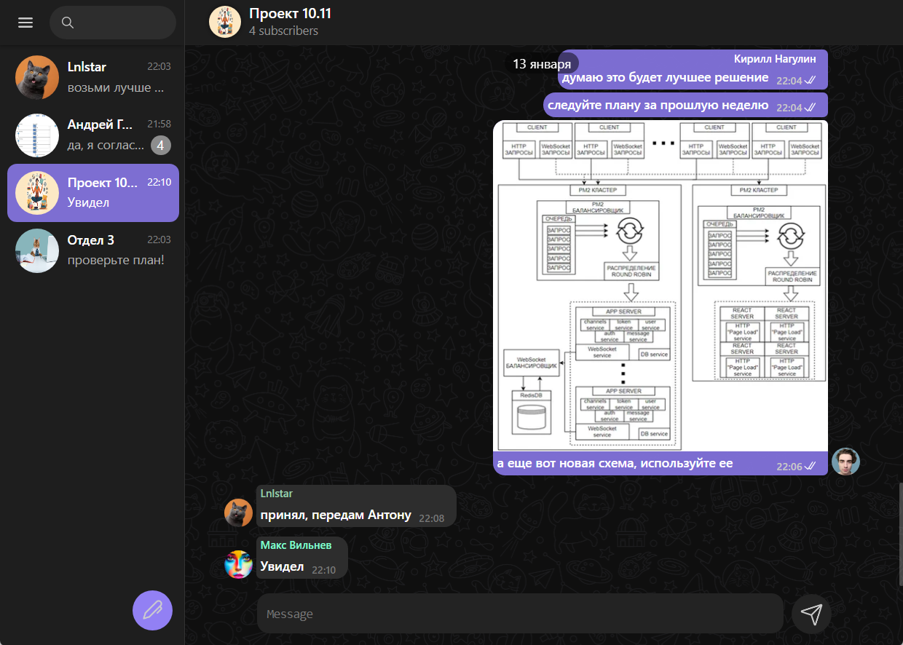
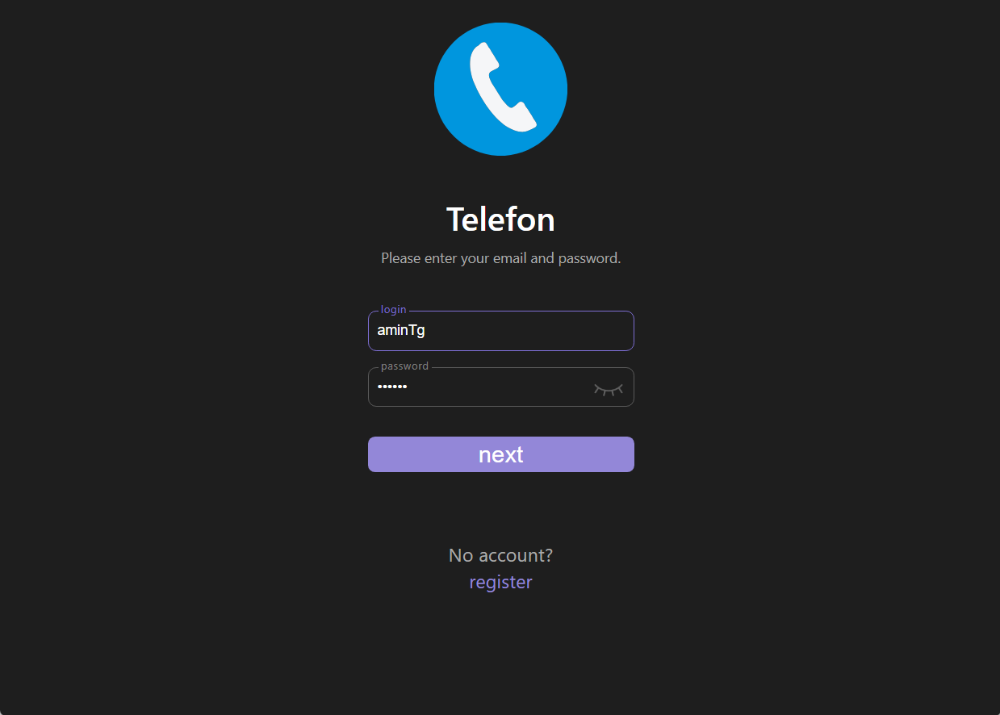
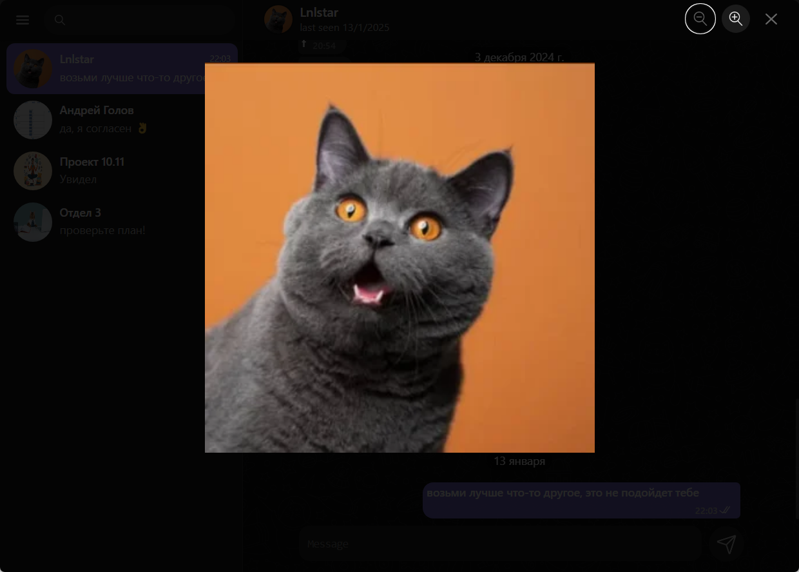

# 📞 **Telefon — A Local Messenger Inspired by Telegram**  

## 📌 Description  
**Telefon** is a pet project aimed at exploring a specific technology stack while replicating the core functionality of Telegram. The application enables real-time messaging, photo sharing, group creation, profile editing, and more.  

### 🔧 Tech Stack  
- **Frontend**: React 18.2, TypeScript, Vite, Redux Toolkit (with Async Thunk & Middleware), React Router  
- **Networking**: Axios, Socket.IO  
- **Animations**: Framer Motion, Lottie React  

<p align="center">
  
</p>


## 🚀 Quick Start  

### 1. Clone the repository  
```bash
git clone https://github.com/kol4id/telefon-client
cd telefon
```
### 2. Install dependencies
```bash
npm install 
```
### 3. Start the server
```bash
npm run dev
```
### 4. Open in browser

The application will be available at:
```bash
http://localhost:5173
```
### 5. Compile and Run the application
If you want to build the production version of the app, run:

```bash
npm run build
npm run preview
```

## 📸 Gallery 
<p align="center">
  <table>
    <tr>
      <td></td>
      <td></td>
    </tr>
    <tr>
      <td></td>
      <td></td>
    </tr>
  </table>
</p>

## 📬 Contact
Author: Nagulin Kirill  
Email: over90006at9@gmail.com  
GitHub: github.com/kol4id  
telegram: @youngbr1ck  
telefon: telefonAdmin